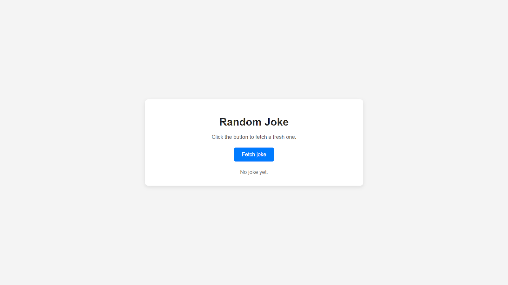
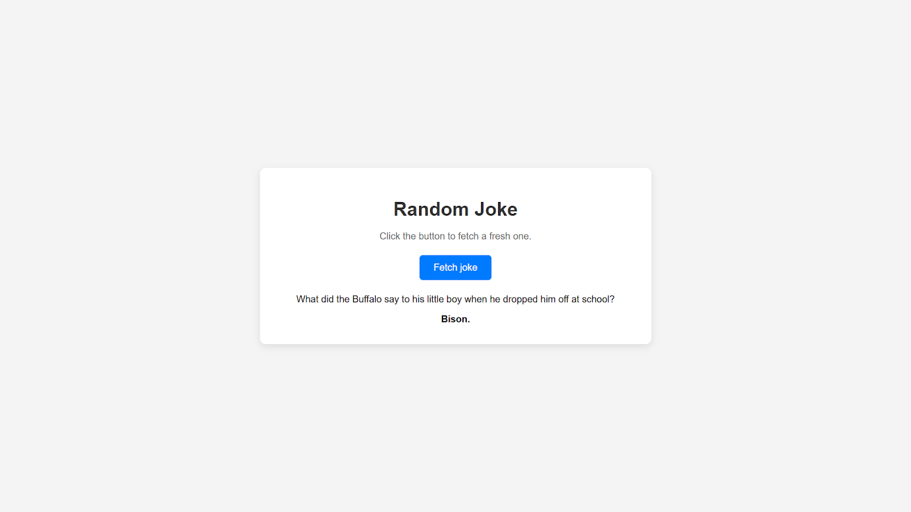
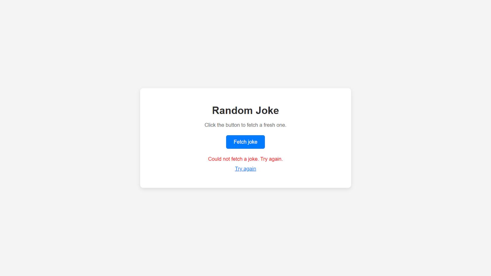

Understand Application Requirements
The task is to fetch a joke from the public API given and then display the joke to the users.

The Application will look like this on initial render :-

The Application will look like this when you fetch a joke :-

The Application will look like this if there was error in fetching the joke :-

NOTE:
Before verifying the correctness of your implementation, please make sure you have done the following things cleanly as this could result in test case failure.

The Texts should be the same as the images given above.
You need to call this API only to fetch jokes :- https://official-joke-api.appspot.com/random_joke
Make sure handle the error correctly and show error messages as shown above.
Make sure when fetching a joke, your button should display Fetching…, this is 3 dots after Fetching
